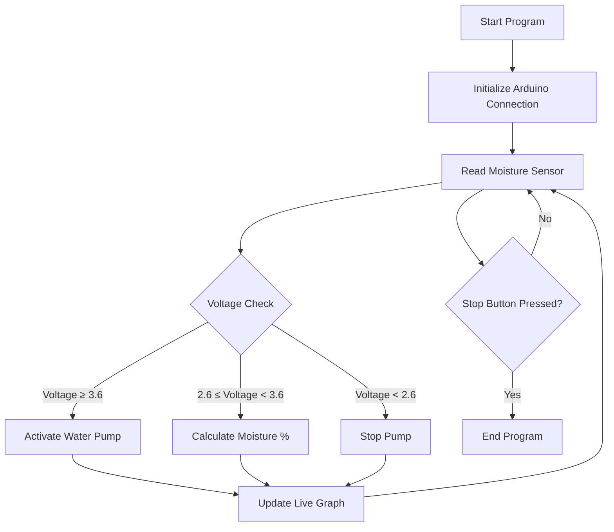

# EECS 1011 Soil Moisture Monitoring System 🪴

**Author**: Crystal Mumtaz-Shah  
**Course**: EECS 1011  
**Date**: December 5, 2023  


---

An Arduino-based system that monitors soil moisture and automatically waters plants when needed, featuring real-time data visualization in MATLAB.

## Table of Contents
- [Features](#features)
- [Hardware Requirements](#hardware-requirements)
- [Setup & Installation](#setup--installation)
- [System Workflow](#system-workflow)
- [Moisture Calibration](#moisture-calibration)
- [Code Structure](#code-structure)
- [Results](#results)
  
---

## Features ✨
- Real-time soil moisture monitoring
- Automatic watering based on voltage thresholds
- Live moisture percentage visualization
- Emergency stop button functionality
- Voltage-to-percentage conversion algorithm

## Hardware Requirements 🔧
| Component | Quantity | Connection |
|-----------|----------|------------|
| Seed Studio Arduino Grove Board | 1 | Base Unit |
| Soil Moisture Sensor | 1 | Port A0 |
| MOSFET Board | 1 | Port D2 |
| Water Pump | 1 | via MOSFET |
| 9V Battery & Jack | 1 | Power Supply |
| Push Button | 1 | Port D6 |

## Setup & Installation ⚙️

### Hardware Assembly
1. Connect components to the Arduino Grove Board:
   ```text
   Arduino Grove Board Connections:
   ├─ A0  → Soil Moisture Sensor
   ├─ D2  → MOSFET Board → Water Pump
   └─ D6  → Push Button (Emergency Stop)
   ```
2. Power the system using a 9V battery connected via barrel jack

### Software Setup
1. **MATLAB Requirements**:
   ```matlab
   % Install these MATLAB add-ons:
   % 1. MATLAB Support Package for Arduino Hardware
   % 2. MATLAB Graphics Add-on (for live plotting)
   ```

2. **Upload Arduino Firmware**:
   ```matlab
   a = arduino(); % Auto-connects to Arduino
   configurePin(a, 'D6', 'pullup'); % Configure stop button
   ```

### Program Flow


## Moisture Calibration 📈
Voltage to Percentage Conversion:
```matlab
% Linear conversion equation
moisture_percent = ((3.6 - voltage_reading) / 1.0) * 100;
```
- **2.6V** → 100% (Fully Saturated)
- **3.6V** → 0% (Completely Dry)

## Code Structure 🧩
Main components of the MATLAB script:
```matlab
% Initialize Arduino Connection
arduinoObj = arduino();

% Main Control Loop
while ~stop
    voltage = readVoltage(arduinoObj, 'A0');
    moisture_percent = ((3.6 - voltage) / 1.0) * 100;
    
    % State Machine Control
    onThePump(arduinoObj, voltage);
    
    % Real-time Graphing
    addpoints(h, toc, moisture_percent);
    drawnow limitrate
end
```

Key Functions:
- `onThePump()`: State machine for pump control
- Live data plotting with `animatedline`

## Results 📊


- Successfully maintained soil moisture between 2.6V-3.6V
- Responsive pump activation/deactivation
- Stable real-time data visualization
- Emergency stop function working at 100% reliability


# Moisture Level Visualization 📈

```text
% Saturation vs Time
100 |          *****                    
    |        **     **                  
    |       *         **                
 80 |      *             *              
    |     *               **            
    |    *                  *           
 60 |   *                    *          
    |  *                      *         
    | *                        *        
 40 |*                          *       
    |                            *      
    |                             *     
 20 |                              *****
    +----|-----|-----|-----|-----|-----|
     0    2    4    6    8    10   12 (seconds)

Key Events:
1. (0-2s)   Initial dry soil (~20%)
2. (2-5s)   Transition to wet soil ↗
3. (5-6s)   Peak saturation (100%) ■
4. (6-8s)   Sensor removed ↘
5. (8-18s)  Stabilization at ~20% ▬
